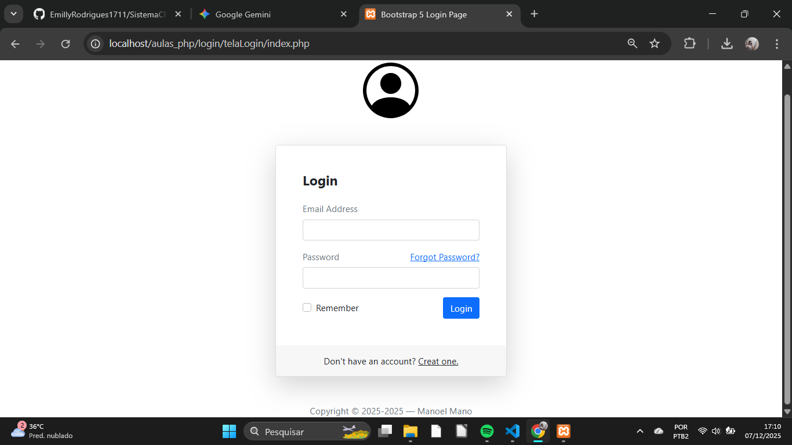
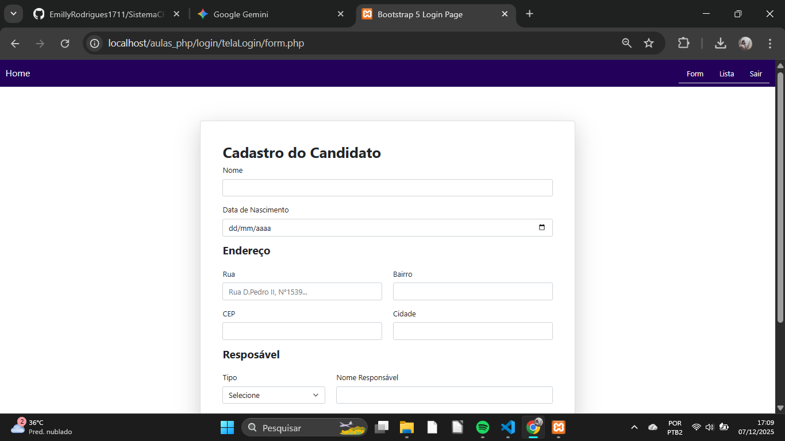
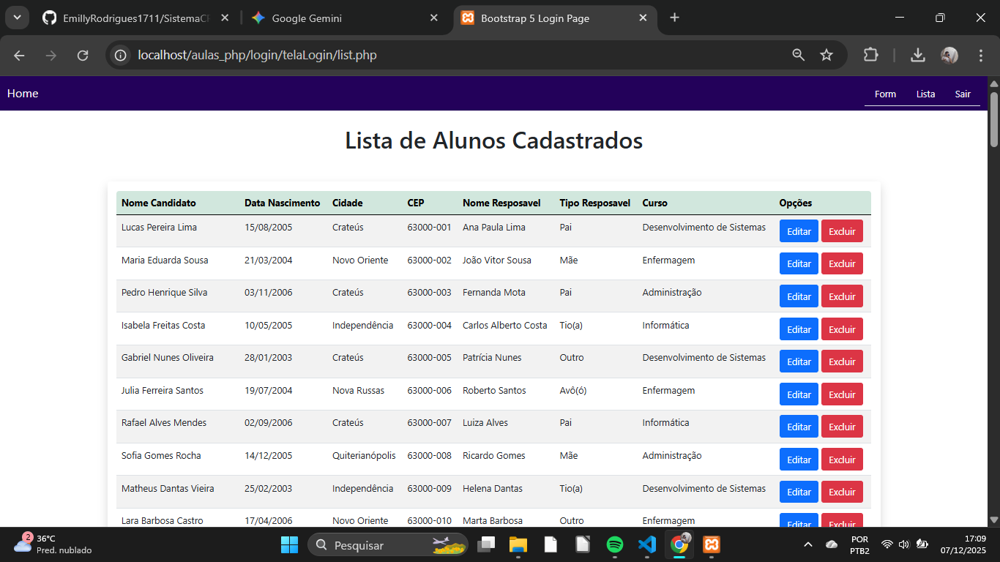
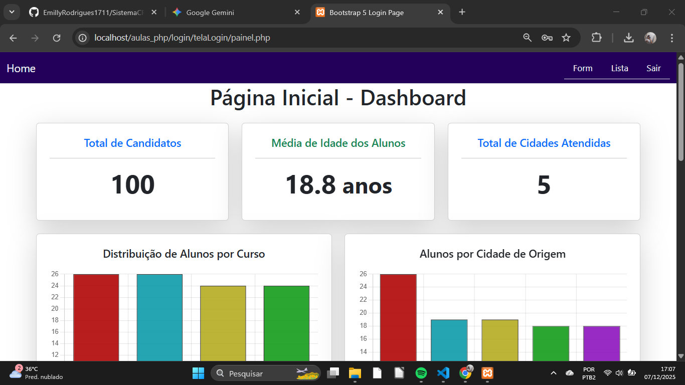
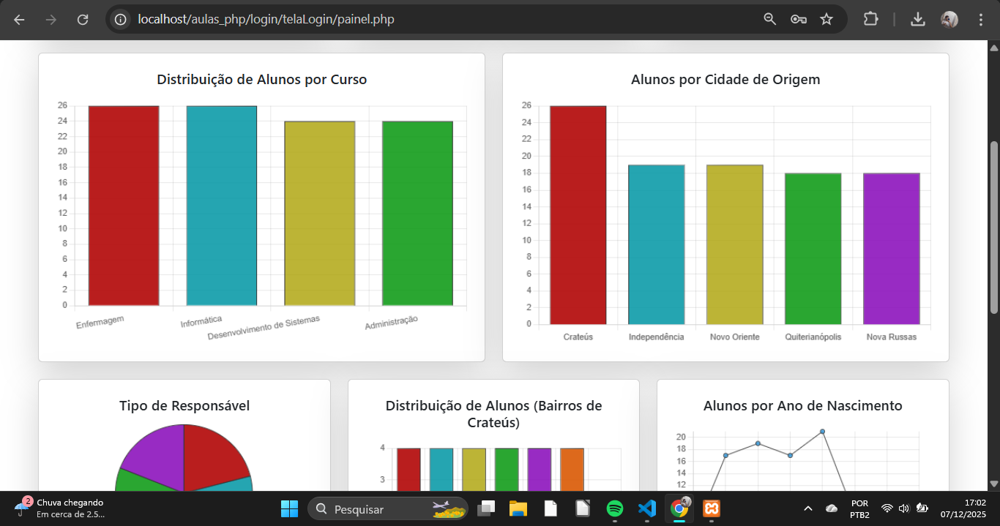

# SISTEMA CRUD - TRABALHO BANCO DE DADOS
* Produzido por **Emilly Rodrigues Silva**.
* Disciplina ministrada pelo Professor: **Adeilson Aragão**.

------

# 1. INTRODUÇÃO

Este projeto consiste no desenvolvimento de um **Sistema CRUD (Create, Read, Update, Delete)** para **o Sistema de Cadastro de Alunos**. O objetivo principal é demonstrar o ciclo completo de interação entre o banco de dados MySQL e uma interface web construída com PHP. O sistema abrange a inserção de dados via formulário e a apresentação de relatórios e análises através de consultas SQL avançadas. Para validação e robustez, o banco de dados foi populado com **mais de 100 registros**.

---

# 2. TECNOLOGIAS UTILIZADAS

* **PHP:** Utilizado como linguagem de *backend* para a lógica do sistema, processamento de formulários e conexão segura com o banco de dados (via MySQLi/PDO).
* **MySQL:** Sistema Gerenciador de Banco de Dados (SGBD) relacional, gerenciado via **PHPMyAdmin**.
* **Servidor Apache (XAMPP/WAMP):** Ambiente local de desenvolvimento para execução dos scripts PHP.
* **HTML5 / CSS3 / Bootstrap:** Linguagens de *frontend* e framework CSS para garantir um design responsivo e acessível para a interface web.
* **Biblioteca Chart.js:** Biblioteca JavaScript utilizada para a **visualização de dados**, gerando gráficos dinâmicos (barras, pizza, etc.) a partir das consultas de agregação do banco de dados.
* **Git / GitHub:** Plataforma utilizada para controle de versão e entrega do código-fonte do projeto.

---

# 3. ESTRUTURA BANCO DE DADOS (SQL)

O sistema utiliza um banco de dados chamado **login**. As duas tabelas principais criadas são `users` (para autenticação) e `alunos` (para o cadastro principal do sistema CRUD).

## 3.1 Tabela users(Auteticação)

Esta tabela armazena as credenciais de acesso para a tela de login (index.php). A senha é armazenada utilizando a função de hash **MD5**, garantindo que a senha original não seja armazenada em texto simples.

sql
CREATE TABLE users (
    user_id INT(11) NOT NULL PRIMARY KEY AUTO_INCREMENT,
    user_name VARCHAR(100) NOT NULL,
    user_email VARCHAR(150) NOT NULL UNIQUE,
    user_password VARCHAR(32) NOT NULL -- O tamanho 32 é compatível com o hash MD5
);

## 3.2 Tabela alunos(Cadastro Principal)

Esta é a tabela central para o CRUD do sistema e para a geração de relatórios e gráficos. Ela armazena os dados pessoais, de endereço e de matrícula dos candidatos.

CREATE TABLE alunos(
    id INT AUTO_INCREMENT PRIMARY KEY,
    nome_aluno VARCHAR(100) NOT NULL,
    data_nasc DATE NOT NULL,
    cidade VARCHAR(50) NOT NULL,
    bairro VARCHAR(80) NOT NULL,
    rua VARCHAR(120) NOT NULL,
    cep VARCHAR(10) NOT NULL,
    nome_responsavel VARCHAR(100) NOT NULL,
    tipo_responsavel INT(1) NOT NULL,  -- 1-pai, 2-mãe, etc...
    curso INT(1) NOT NULL -- 1-enfermagem, 2-informatica, etc...
);

## 3.3 População do Banco de Dados:
 O arquivo SQL completo, contendo os comandos CREATE TABLE e mais de 100 registros (INSERT INTO), deve ser importado através do PHPMyAdmin e está disponível na raiz do repositório com o nome: banco_populacao.sql.

---

# 4. CONSULTAS CRIADAS E ANALISES VISUAIS

As 10 consultas abaixo estão implementadas no arquivo painel.php e são a base para a geração dos gráficos, cards e relatórios do sistema. 

* **Consulta #1**: Alunos por Cidade, **Visualização por Gráfico**
-> SELECT cidade, COUNT(id) AS Total 
FROM alunos GROUP BY cidade ORDER BY Total DESC;

* **Consulta #2**: Alunos por Curso, **Visualização por Gráfico**
-> SELECT curso, COUNT(id) AS Total 
FROM alunos GROUP BY curso ORDER BY curso;

* **Consulta #3**: Tipo de Responsáve, **Visualização por Gráfico**
-> SELECT tipo_responsavel, COUNT(id) AS Total 
FROM alunos GROUP BY tipo_responsavel;

* **Consulta #4**: Alunos por Bairro (Apenas Crateús), **Visualização por Gráfico**
-> SELECT bairro, COUNT(id) AS Total 
FROM alunos WHERE cidade = 'Crateús' GROUP BY bairro 
HAVING Total > 1 ORDER BY Total DESC;

* **Consulta #5**: Distribuição de Idade (Ano de Nascimento), **Visualização por Gráfico**
-> SELECT YEAR(data_nasc) AS Ano, COUNT(id) AS Total 
FROM alunos GROUP BY Ano ORDER BY Ano;

* **Consulta #6**: Total Geral de Candidatos, **Visualização por Cards**
-> SELECT COUNT(id) AS Total FROM alunos;

* **Consulta #7**: Média de Idade, **Visualização por Cards**
-> SELECT AVG(YEAR(CURDATE()) - YEAR(data_nasc)) AS Media_Idade FROM alunos;

* **Consulta #8**: Cidades Atendidas / **Baseado na Consulta #1**, **Visualização por Cards**
-> SELECT cidade, COUNT(id) AS Total 
FROM alunos GROUP BY cidade ORDER BY Total DESC;

* **Consulta #9**: Alunos Mais Novos, **Visualização por Relatório**
-> SELECT nome_aluno, data_nasc, nome_responsavel 
FROM alunos ORDER BY data_nasc DESC LIMIT 5;

* **Consulta #10**: Alunos de Crateús Detalhado,  **Visualização por Relatório**
->SELECT nome_aluno, rua, bairro, cep
FROM alunos WHERE cidade = 'Crateús' ORDER BY bairro, nome_aluno LIMIT 5;

----

# 5. DEMONTRAÇÃO DO SISTEMA

1. **Tela Login e Cadastro de Usuário**
    
2. **Interface CRUD** (Formulário e Lista de Alunos)
    
    
3. **Dashboard de Análise** (painel.php com Gráficos, Cards e Relatórios)
    
    
    
    